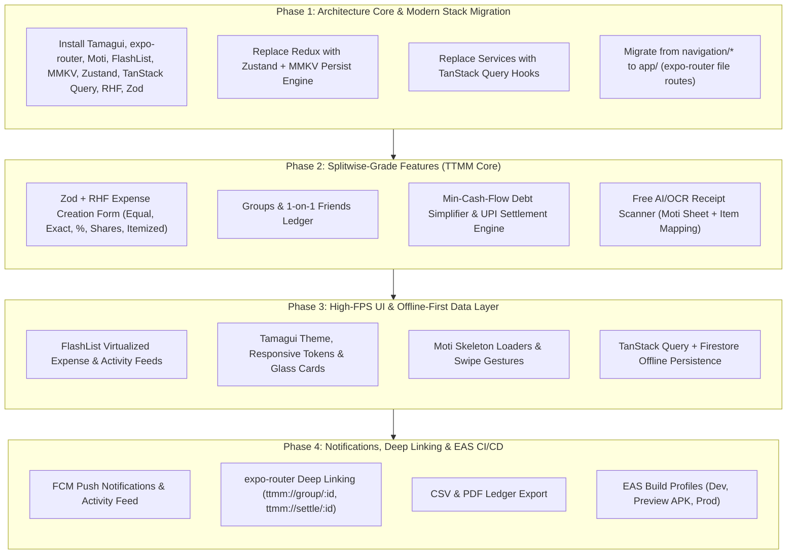

# TTMM — The Modern Splitwise Alternative: Master Architecture & Implementation Plan

> **TTMM ("Tera Tu Mera Mai" / Go Dutch)**: A next-generation, offline-first expense splitting and debt settlement application built with the **modern mobile stack**:
> **Expo SDK 56 + expo-router + Tamagui + Moti + @shopify/flash-list + MMKV + Zustand + TanStack Query + Zod & React Hook Form + Firebase**.

---

## 🏗️ Modern Architectural Blueprint

```
                     ┌────────────────────────────────────────────────────────┐
                     │               TTMM App (Expo SDK 56)                   │
                     └──────────────────────────┬─────────────────────────────┘
                                                │
          ┌─────────────────────────────────────┼─────────────────────────────────────┐
          │                                     │                                     │
          ▼                                     ▼                                     ▼
┌──────────────────┐                  ┌──────────────────┐                  ┌──────────────────┐
│ UI & Interaction │                  │ State & Storage  │                  │ Data & Services  │
├──────────────────┤                  ├──────────────────┤                  ├──────────────────┤
│ • Tamagui UI     │                  │ • TanStack Query │                  │ • Firebase Auth  │
│ • Moti Motion    │                  │   (Server State) │                  │ • Cloud Firestore│
│ • FlashList      │                  │ • Zustand + MMKV │                  │ • FCM Messaging  │
│ • expo-router    │                  │   (Client State) │                  │ • Camera / OCR   │
│ • RHF + Zod      │                  │                  │                  │ • UPI Deep-links │
└──────────────────┘                  └──────────────────┘                  └──────────────────┘
```

### 1. Architectural Principles & Separation of Concerns

| Domain | Selected Technology | Architectural Role | Why It Beats the Legacy Stack |
| :--- | :--- | :--- | :--- |
| **Routing & Navigation** | **`expo-router`** (v56) | File-based routing (`app/`), deep linking (`ttmm://`), typed routes, modal presentations | Replaces bulky manual React Navigation stacks. First-class deep link routing for group invites & settlements. |
| **Design System & UI** | **Tamagui** | Universal styled components, responsive themes, zero-runtime optimization | Replaces `react-native-paper`. Drastically faster styling, cross-platform tokens, cohesive design system. |
| **Motion & Micro-UX** | **Moti** | 60fps declarative animations, skeleton loading (`moti/skeleton`), spring gestures | Built on Reanimated 4, eliminates imperative animation clutter. |
| **High-Performance Lists**| **`@shopify/flash-list`** | Virtualized feeds for hundreds of expenses, groups, and activity items | 5x to 10x faster recycling than `FlatList`, eliminating frame drops during fast scrolling. |
| **Client UI State & Storage** | **Zustand + `react-native-mmkv`** | Synchronous client-only UI state (theme mode, active tab, multi-step split form progress) | Replaces Redux + AsyncStorage. MMKV is C++ native & synchronous: **zero-lag startup hydration**. |
| **Server State & Cache** | **TanStack Query** (`@tanstack/react-query`) | 100% of asynchronous Firebase API queries, mutations, cache invalidation, and optimistic updates | Clean separation: server state stays in TanStack; client UI state stays in Zustand. |
| **Forms & Validation** | **React Hook Form + Zod** | Controlled/uncontrolled form inputs, type-safe schemas, split math guardrails | Eliminates component re-renders per keystroke while enforcing strict Zod validation. |

---

## 🎯 Value Proposition: TTMM vs. Splitwise

| Feature | Splitwise (Free vs Pro) | TTMM Modern Alternative |
| :--- | :--- | :--- |
| **Daily Expense Limit** | ⚠️ Throttled to 3–4 expenses/day on Free | ✅ **Unlimited free expenses forever** |
| **Receipt OCR Scanning** | 🔒 Paywalled ($39.99/yr) | ✅ **Free AI & OCR receipt scanning** with itemized assignment |
| **Ads & Intrusiveness** | ⚠️ Full-screen video ads & intrusive banners | ✅ **100% Ad-Free**, pure fluid UX |
| **Cold Startup Hydration** | ⚠️ Slow (~3–4 seconds with AsyncStorage/SQLite) | ✅ **Instant startup (< 1.2s)** with MMKV C++ storage |
| **Scroll Performance** | ⚠️ Noticeable lag with large expense histories | ✅ **Silky 60fps FlashList** recycling |
| **Debts Simplification** | 🔒 Complex & paywalled multi-currency | ✅ **Automated Min-Cash-Flow engine** for groups & friends |
| **Instant Settlement** | ⚠️ Generic web redirect | ✅ **One-tap UPI Intent** (GPay/PhonePe/Paytm) + Cash/PayPal |
| **Offline Capability** | ⚠️ Spinners and blocking loaders | ✅ **True Offline-First** with TanStack Query + Firestore cache |

---

## 🗺️ Migration & Implementation Roadmap



---

## 🛠️ Detailed Architectural Implementations

### 1. MMKV + Zustand Synchronous Persist Engine

*Target File*: [`store/useAppStore.ts`](file:///D:/TTMM/TTMM_expo/store/useAppStore.ts)

```typescript
import { create } from 'zustand';
import { persist, createJSONStorage, StateStorage } from 'zustand/middleware';
import { MMKV } from 'react-native-mmkv';

const storage = new MMKV({ id: 'ttmm-storage' });

// Bridge MMKV to Zustand persist
const mmkvStorage: StateStorage = {
  setItem: (name, value) => storage.set(name, value),
  getItem: (name) => storage.getString(name) ?? null,
  removeItem: (name) => storage.delete(name),
};

interface UIState {
  isDark: boolean;
  activeGroupId: string | null;
  selectedCurrency: string;
  biometricLockEnabled: boolean;
  toggleTheme: () => void;
  setActiveGroup: (groupId: string | null) => void;
  setCurrency: (currency: string) => void;
  setBiometricLock: (enabled: boolean) => void;
}

export const useAppStore = create<UIState>()(
  persist(
    (set) => ({
      isDark: false,
      activeGroupId: null,
      selectedCurrency: 'INR',
      biometricLockEnabled: false,
      toggleTheme: () => set((state) => ({ isDark: !state.isDark })),
      setActiveGroup: (groupId) => set({ activeGroupId: groupId }),
      setCurrency: (currency) => set({ selectedCurrency: currency }),
      setBiometricLock: (enabled) => set({ biometricLockEnabled: enabled }),
    }),
    {
      name: 'ttmm-ui-storage',
      storage: createJSONStorage(() => mmkvStorage),
    }
  )
);
```

---

### 2. TanStack Query Server State & Firestore Hooks

*Target Files*: `queries/useExpenses.ts`, `queries/useGroups.ts`, `queries/useSettlements.ts`

- **Queries**:
  - `useGroupsQuery(userId)`: Caches all active user groups with automatic background refetching.
  - `useExpensesQuery(groupId)`: Retrieves and caches group expenses with cache invalidation on new entries.
  - `useBalancesQuery(groupId)`: Computes pairwise and simplified debts.
- **Mutations & Optimistic Updates**:
  - `useAddExpenseMutation()`:
    - Optimistically prepends new expense to TanStack cache.
    - If network drops, write is held in Firestore offline persistence.
    - Automatically invalidates `['expenses', groupId]` and `['balances', groupId]` upon sync.

---

### 3. Zod + React Hook Form Engine

*Target File*: `schemas/expenseSchema.ts`, `components/forms/ExpenseForm.tsx`

```typescript
import { z } from 'zod';

export const expenseSplitSchema = z.object({
  userId: z.string(),
  amount: z.number().min(0),
  percentage: z.number().min(0).max(100).optional(),
  shares: z.number().min(0).optional(),
});

export const createExpenseSchema = z.object({
  title: z.string().min(1, 'Title is required').max(80),
  amount: z.number().positive('Amount must be greater than zero'),
  currency: z.string().default('INR'),
  groupId: z.string().min(1, 'Select a group'),
  paidBy: z.string().min(1, 'Select who paid'),
  category: z.enum(['food', 'drinks', 'groceries', 'transport', 'entertainment', 'utilities', 'other']),
  splitType: z.enum(['equal', 'exact', 'percentage', 'shares', 'itemized']),
  splits: z.array(expenseSplitSchema).min(1),
  date: z.date().default(() => new Date()),
  receiptUri: z.string().optional(),
}).refine((data) => {
  if (data.splitType === 'exact') {
    const totalSplit = data.splits.reduce((acc, s) => acc + s.amount, 0);
    return Math.abs(totalSplit - data.amount) < 0.01;
  }
  if (data.splitType === 'percentage') {
    const totalPct = data.splits.reduce((acc, s) => acc + (s.percentage ?? 0), 0);
    return Math.abs(totalPct - 100) < 0.1;
  }
  return true;
}, {
  message: 'Splits do not add up to total expense amount',
  path: ['splits'],
});

export type CreateExpenseInput = z.infer<typeof createExpenseSchema>;
```

---

### 4. expo-router File-Based Structure

We will organize `app/` according to standard `expo-router` v56 best practices:

```
app/
├── _layout.tsx                  # Root layout (TamaguiProvider, QueryClientProvider, Auth Gate)
├── (auth)/
│   ├── _layout.tsx              # Auth stack
│   ├── login.tsx                # Login Screen
│   ├── signup.tsx               # Sign-up Screen
│   └── forgot-password.tsx      # Password Recovery
├── (tabs)/
│   ├── _layout.tsx              # Bottom Tab Navigator
│   ├── index.tsx                # Groups list screen
│   ├── friends.tsx              # 1-on-1 Friends ledger screen
│   ├── activity.tsx             # Audit feed screen
│   └── profile.tsx              # User profile & settings
├── group/
│   └── [id].tsx                 # Group details, expenses & balances
├── expense/
│   ├── add.tsx                  # Add Expense screen (modal presentation)
│   ├── [id].tsx                 # Expense details screen
│   └── scan.tsx                 # OCR Receipt Scanner modal
└── settle/
    └── [id].tsx                 # Settlement & UPI one-tap payment
```

---

### 5. High-Performance Virtualization & Motion

- **`@shopify/flash-list`**:
  - Replaces all `FlatList` usages in `app/(tabs)/index.tsx`, `app/group/[id].tsx`, and `app/(tabs)/activity.tsx`.
  - Configured with `estimatedItemSize={72}` for zero-jank 120Hz/60Hz scrolling.
- **Moti Animation**:
  - `<AnimatePresence>` for fluid split mode transitions.
  - `MotiView` for spring entry animations on expense items.
  - Skeleton screens with `moti/skeleton` while TanStack Query fetches data.
- **Tamagui UI Components**:
  - Replaces `react-native-paper`.
  - `YStack`, `XStack`, `Card`, `Button`, `Input`, `Dialog`, `Sheet` with customized theme tokens (Light, Dark, and High Contrast).

---

## 📅 Implementation Execution Plan

| Milestone | Key Deliverables |
| :--- | :--- |
| **Milestone 1: Stack Modernization** | • Install: `tamagui`, `expo-router`, `moti`, `@shopify/flash-list`, `zustand`, `react-native-mmkv`, `@tanstack/react-query`, `react-hook-form`, `zod`, `@hookform/resolvers`<br>• Clean up: Remove Redux, AsyncStorage, react-native-paper, and direct `@react-navigation/*` dependencies<br>• Configure Tamagui provider & Zustand MMKV persist adapter |
| **Milestone 2: expo-router Migration** | • Re-establish `app/` directory with `_layout.tsx`, `(tabs)`, `(auth)`, `group/[id].tsx`, `expense/add.tsx`<br>• Migrate screen logic cleanly from `screens/` to `app/` |
| **Milestone 3: Splitwise-Grade Engine** | • React Hook Form + Zod expense builder with Equal, Exact, %, Shares & Itemized splits<br>• Min-Cash-Flow debt simplification algorithm<br>• UPI Intent (`upi://pay`) & Cash settlements |
| **Milestone 4: High-FPS UI & Moti** | • `@shopify/flash-list` virtualization for groups, expenses & activity feeds<br>• Moti skeleton loading & smooth entry animations<br>• Haptic feedback (`expo-haptics`) |
| **Milestone 5: Verification & EAS CI/CD** | • `npx expo-doctor` & TypeScript validation (`tsc --noEmit`)<br>• EAS build profiles for internal preview & store deployment |
